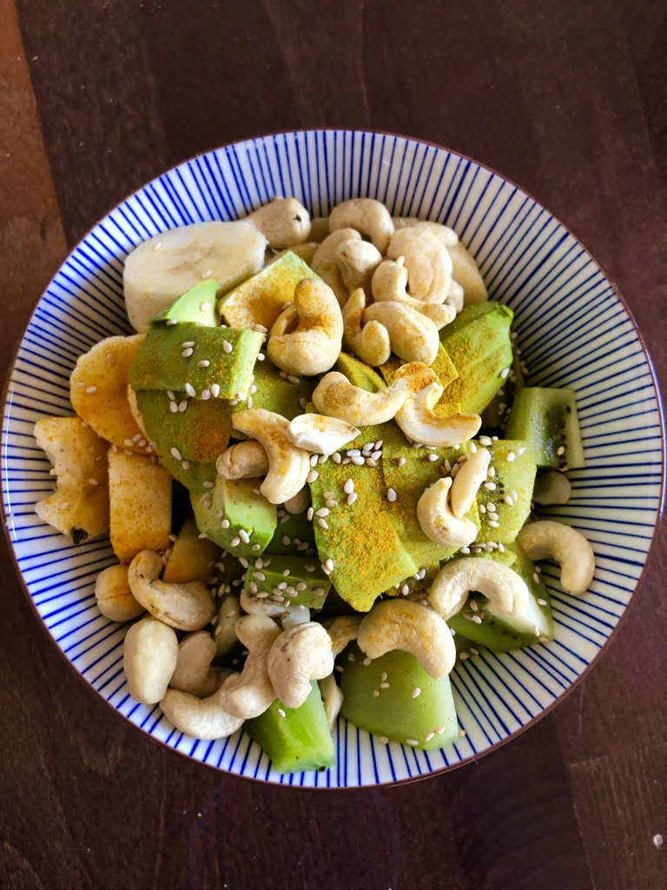

> Servings: 1 Bowl

### Ingredients

- 1 banana
- 1 avocado
- 1 kiwi
- handful of cashews
- pinch sesame seeds
- 1 tbs kurkuma
- 1 tbs curry

### Instructions

Cut the fruit into mouth-sized dices and add them to the served bowl. Top with cashews, kurkuma, curry and sprinkle the sesame.
